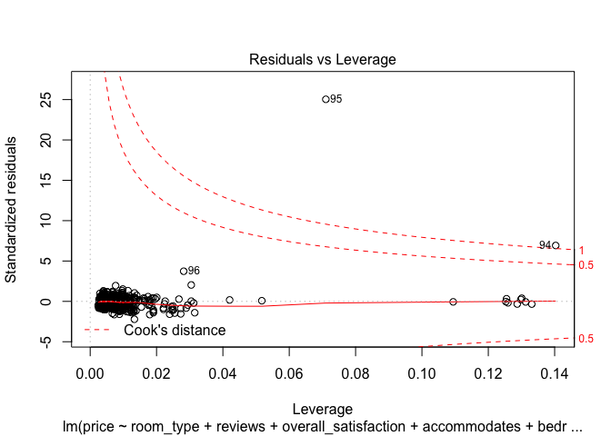

***
Load up Libraries


```r
library(dplyr)
library(ggplot2)
library(GGally)
```

## Airbnb Data

```r
airbnb_df = read.csv(paste(path,"airbnb_data.csv",sep=""))
knitr::kable(head(airbnb_df, 4), "pandoc")
```


  room_id   survey_id     host_id  room_type     city         reviews   overall_satisfaction   accommodates   bedrooms   price
---------  ----------  ----------  ------------  ----------  --------  ---------------------  -------------  ---------  ------
 15771735        1498   101992409  Shared room   Asheville          0                    0.0              4          1      67
 18284194        1498   126414164  Shared room   Asheville         32                    5.0              4          1      76
 18091012        1498   122380971  Shared room   Asheville          4                    4.5              2          1      45
 12286328        1498      746673  Shared room   Asheville         24                    4.5              6          1      26

#### Let's fit a multiple linear regression model using price as the response variable and all others as predictor variables (Note: remove ‘id’ columns). We will check which variables are statistically significant in determining the price.


```r
#Remove all 'id' columns first
airbnb_df_no_ID = select(airbnb_df, -contains("id"))
knitr::kable(head(airbnb_df_no_ID, 4), "pandoc")
```


room_type     city         reviews   overall_satisfaction   accommodates   bedrooms   price
------------  ----------  --------  ---------------------  -------------  ---------  ------
Shared room   Asheville          0                    0.0              4          1      67
Shared room   Asheville         32                    5.0              4          1      76
Shared room   Asheville          4                    4.5              2          1      45
Shared room   Asheville         24                    4.5              6          1      26


```r
#Create Multiple Linear Regression Model
#Not mentioned in the question, but apparently this df only contains one city "Asheville"
#We will not include that in the model as it is not useful
air_MLM = lm(price ~ room_type + reviews + overall_satisfaction + accommodates + bedrooms, data=airbnb_df_no_ID)

#Display model output
summary(air_MLM)
```

```
## 
## Call:
## lm(formula = price ~ room_type + reviews + overall_satisfaction + 
##     accommodates + bedrooms, data = airbnb_df_no_ID)
## 
## Residuals:
##    Min     1Q Median     3Q    Max 
## -367.8  -49.2    3.2   38.6 4032.7 
## 
## Coefficients:
##                        Estimate Std. Error t value Pr(>|t|)    
## (Intercept)           -23.36172   21.88618  -1.067  0.28609    
## room_typePrivate room  -0.93115   13.21827  -0.070  0.94386    
## room_typeShared room  -76.66780   59.90939  -1.280  0.20099    
## reviews                 0.01090    0.09982   0.109  0.91310    
## overall_satisfaction  -10.48160    3.47320  -3.018  0.00262 ** 
## accommodates           23.00721    5.23952   4.391 1.27e-05 ***
## bedrooms               85.64533   11.45983   7.474 1.95e-13 ***
## ---
## Signif. codes:  0 '***' 0.001 '**' 0.01 '*' 0.05 '.' 0.1 ' ' 1
## 
## Residual standard error: 167.1 on 847 degrees of freedom
## Multiple R-squared:  0.3228,	Adjusted R-squared:  0.318 
## F-statistic:  67.3 on 6 and 847 DF,  p-value: < 2.2e-16
```

As we can see from the above summary output from the model, the variables that are statistically significant in determining price are: __“overall_satisfaction”__, __“accommodates”__ and __“bedrooms”__. This is assuming an alpha value of .05.

### How would we interpret coefficients for predictors?
- Ex.1) A shared room is associated with a decrease of $76.67 in price on average holding all else constant.
- Ex.2) A one unit increase in bedrooms (so each additional bedroom) is associated with an increase of $85.65 in price on average holding all else constant.

#### Let's take an example and predict the price using the above multiple linear model. How about a listing with 1 bedroom that can accomodate 2 people, with total of 70 reviews with mean rating of 4 that is a private room. What does our model estimate its rental price should be?


```r
pred_data = data.frame(bedrooms=1, accommodates=2, reviews=70, overall_satisfaction=4, room_type='Private room')
#Prediction using Prediction interval
air_MLM_pred = predict(air_MLM, pred_data, interval = "predict")
air_MLM_pred
```

```
##        fit       lwr      upr
## 1 66.20316 -262.3605 394.7669
```

As we can see from the output of the prediction above, with the following factor values: bedrooms = 1, accommodates = 2, reviews = 70, overall_satisfaction = 4, and room_type = ‘Private room’ the predicted price is $66.

As an aside, when doing predictions, I will include both prediction and confidence intervals so we can compere the lower and upper bounds.

For additional edification on which you should use: According to ISLR we should use a prediction interval if we wish to predict an individual response and use a confidence interval if we wish to predict the average response. Also, this [article](http://www.sthda.com/english/articles/40-regression-analysis/166-predict-in-r-model-predictions-and-confidence-intervals/) sums it up nicely. From the article, “A prediction interval reflects the uncertainty around a single value, while a confidence interval reflects the uncertainty around the mean prediction values. Thus, a prediction interval will be generally much wider than a confidence interval for the same value.”

Checkout this [video](https://www.youtube.com/watch?feature=player_embedded&v=o0UESA3UZss) for more context on confidence interval vs. prediction interval:  

#### Next let's identify outliers using Cook’s distance approach.

Identify outliers using Cook’s distance approach. Remove points having Cook’s distance > 1. Rerun the model after the removal of these points and print the summary.


```r
#Find leverage points using the Residuals vs Leverage plot
#Cook's distance > 1 
plot(air_MLM, which = 5)
```

<!-- -->


```r
#Remove identified leverage points
airbnb_df_no_ID_clean = airbnb_df_no_ID[-c(94, 95),]

#Rerun the model after removing points where Cook's distance is > 1
air_MLM_clean = lm(price ~ room_type + reviews + overall_satisfaction + accommodates + bedrooms, data=airbnb_df_no_ID_clean)
summary(air_MLM_clean)
```

```
## 
## Call:
## lm(formula = price ~ room_type + reviews + overall_satisfaction + 
##     accommodates + bedrooms, data = airbnb_df_no_ID_clean)
## 
## Residuals:
##     Min      1Q  Median      3Q     Max 
## -190.95  -32.43   -7.09   20.35  876.26 
## 
## Coefficients:
##                        Estimate Std. Error t value Pr(>|t|)    
## (Intercept)            75.01310    9.09152   8.251 6.01e-16 ***
## room_typePrivate room -32.28201    5.38034  -6.000 2.92e-09 ***
## room_typeShared room  -91.69951   24.28958  -3.775 0.000171 ***
## reviews                -0.05915    0.04047  -1.462 0.144202    
## overall_satisfaction   -6.78957    1.41118  -4.811 1.78e-06 ***
## accommodates           11.90698    2.14267   5.557 3.68e-08 ***
## bedrooms               35.93177    4.87968   7.364 4.25e-13 ***
## ---
## Signif. codes:  0 '***' 0.001 '**' 0.01 '*' 0.05 '.' 0.1 ' ' 1
## 
## Residual standard error: 67.73 on 845 degrees of freedom
## Multiple R-squared:  0.4249,	Adjusted R-squared:  0.4208 
## F-statistic:   104 on 6 and 845 DF,  p-value: < 2.2e-16
```

Isn't this facinating? The summary output seems to make way more logical sense now. After removing records 94 and 95, where Cook’s distance > 1, the only X variable that doesn’t look significant is now reviews. Assuming an alpha of .05, all other predictor variables look significant to the model. We can also see from the newly plotted Residuals vs Leverage plot that no values exceed Cook’s distance > 1.

And next let’s run a new prediction model using the cleaned data set.


```r
#Predicting using confidence interval
air_MLM_pred_clean = predict(air_MLM_clean, pred_data, interval = "confidence")
air_MLM_pred_clean
```

```
##        fit      lwr      upr
## 1 71.17796 63.65645 78.69946
```


```r
#predicting using Prediction interval
air_MLM_pred_clean = predict(air_MLM_clean, pred_data, interval = "prediction")
air_MLM_pred_clean
```

```
##        fit       lwr      upr
## 1 71.17796 -61.98274 204.3387
```

Compared to our first prediction, the new prediction has much narrower lower and upper bands with a predicted value of $71.
